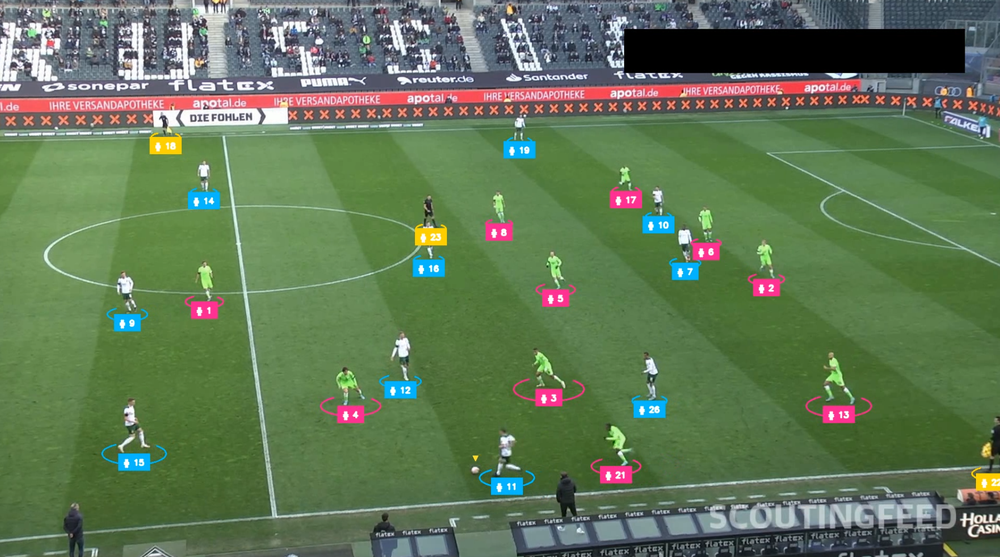
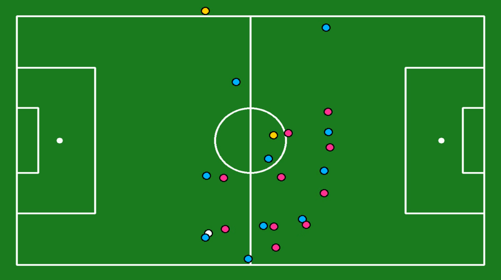
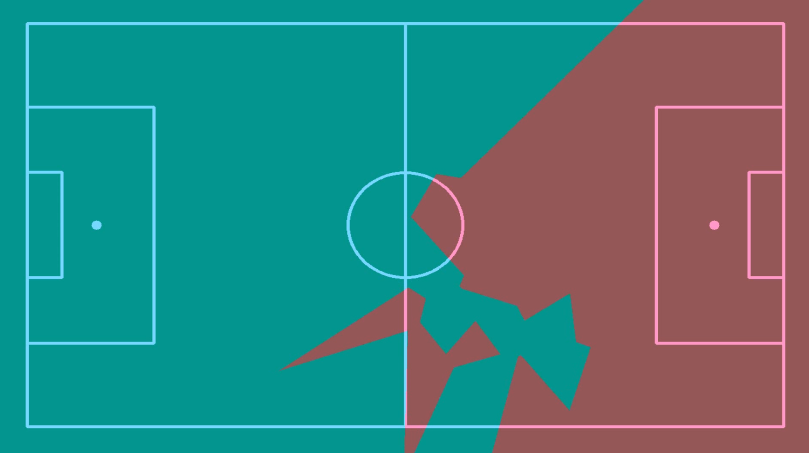
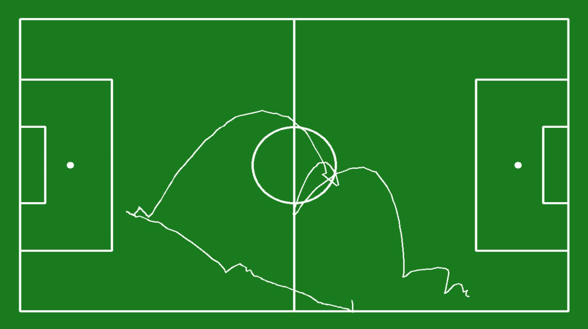

# ⚽ Football Object Detection 

This repository contains a complete pipeline for football (soccer) player, ball detection and tracking team classification using computer vision techniques.

Using powerful frameworks like [Ultralytics YOLOv8](https://github.com/ultralytics/ultralytics), [Supervision](https://github.com/roboflow/supervision) and [Roboflow](https://roboflow.com/), this system enables:
- Real-time object detection (players, ball, referee, goalkeeper)
- Team classification
- Perspective transformation onto pitch diagrams
- Voronoi-based territory control visualization
- Ball trajectory tracking and smoothing
- Annotated video output for tactical review

---

## 📽️ Demo

<p align="center">
  
</p>


<p align="center">
  
</p>


<p align="center">
  
</p>

<p align="center">
  
</p>


---
## 🔧 Features

- ✅ **Player/ball/referee detection** with YOLOv8 via Ultralytics
- ✅ **Team classification** using jersey color crops
- ✅ **ByteTrack integration** for multi-object tracking
- ✅ **View transformation** to map detections onto a 2D pitch
- ✅ **Voronoi diagram rendering** for spatial control analysis
- ✅ **Ball path trajectory** with smoothing and outlier filtering

---
## 🚀 How It Works

1. **Detection**: Use YOLOv8 models for detecting players, referees, and the ball.
2. **Tracking**: Each object is assigned a consistent ID using ByteTrack.
3. **Team Classification**: Player crops are classified into teams (e.g., blue vs pink jerseys).
4. **Pitch Mapping**:

   * A pitch keypoint detection model infers known points.
   * Perspective transformation warps frame coordinates to pitch coordinates.
5. **Voronoi Territory**:

   * Compute per-team control zones using Voronoi diagrams on mapped player coordinates.
6. **Ball Path Tracking**:

   * Track and smooth the ball’s movement using recent transformation matrices.
   * Detect and replace outlier coordinates for cleaner visualization.
---
## 🙌 Acknowledgements

* [Ultralytics YOLOv8](https://github.com/ultralytics/ultralytics)
* [Roboflow](https://roboflow.com)
* [Supervision by Roboflow](https://github.com/roboflow/supervision)
* [ByteTrack](https://github.com/ifzhang/ByteTrack)

---
## 📦 Dependencies

Make sure to install the following key dependencies:

```bash
pip install ultralytics roboflow supervision opencv-python numpy tqdm
```


